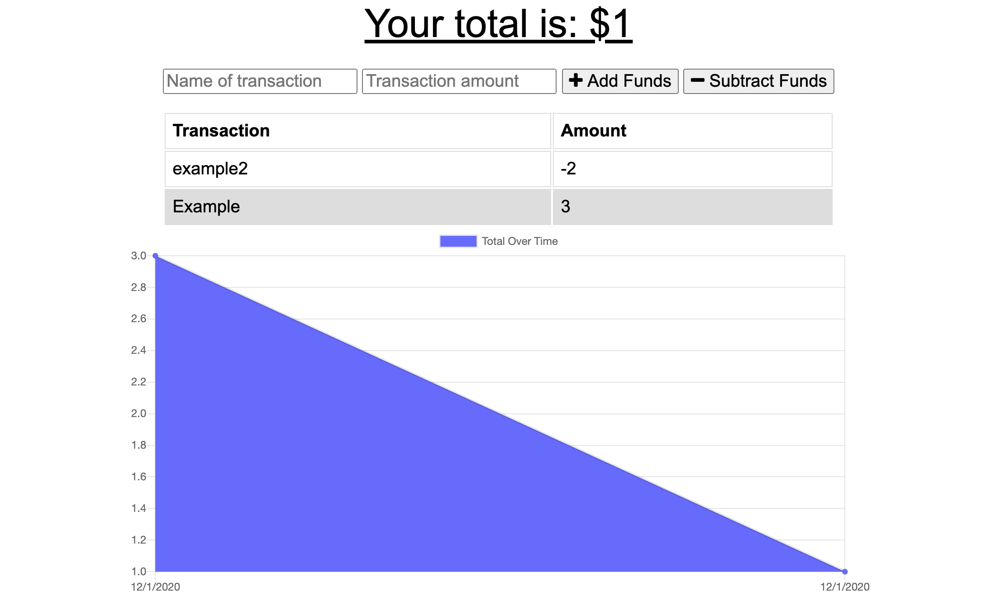

# budget-app
A budgeting application with offline capabilities


# Purpose

This app was built to address an assigned user story:

```
AS AN avid traveller
I WANT to be able to track my withdrawals and deposits with or without a data/internet connection
SO THAT my account balance is accurate when I am traveling

```

When a user is connected to the internet, the app will function as normal. When the user is not connected, any transactions entered will be shown on the page and added to their transaction history when reconnected. 

The following is an example of the user interface:



## Dependencies

This app requires the following npm packages: "compression", "express", "lite-server", "mongoose", "morgan". To install these packages, please run an "npm install" command. 

## Links

Please see the following example of the launched application: 

[Demo Deployed App] (https://desolate-ridge-68330.herokuapp.com)

